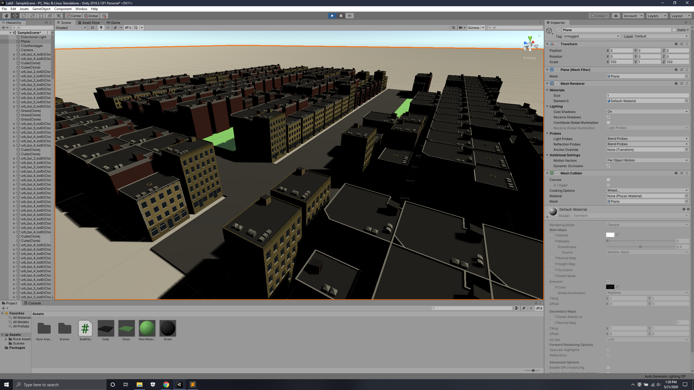

# CMPM163Labs
a) Part 1

i.

ii.

iii. 
I wanted to get a suburban look, so I added more grass and reset the map so that the grass are generated in like lawns or backyards.

iv.
Lab was created in a new folder/project

d.
At the time of completion, partner has not responded to msgs.
