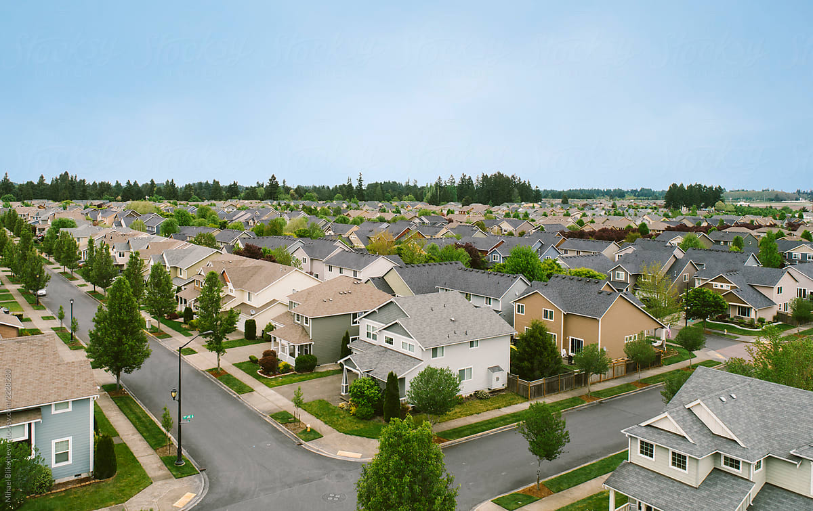

# CMPM163Labs
a) Part 1

i.

ii.

iii. 
I wanted to get a suburban look, so I added more grass and reset the map so that the grass are generated in like lawns or backyards.

iv.
Lab was created in a new folder/project

d.
my partner did part 2, found determination of grid height and value to be somewhat difficult, liked the perlin noise texture. We only checked in with eachother at the end of the lab.
