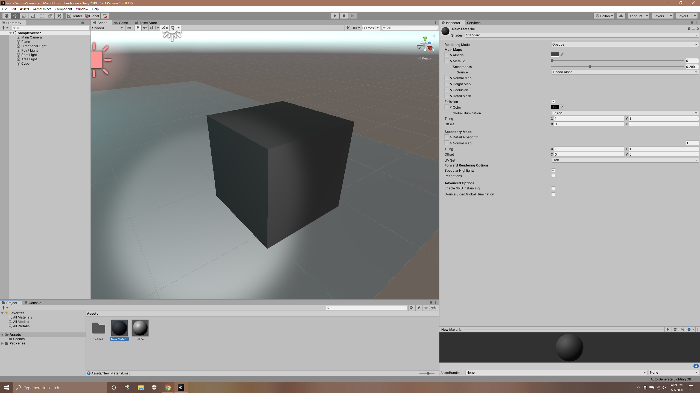

# CMPM163Labs

Part1: Unity

Definitions:

Point Light: A light emitting a light from one point in all directions around the point, like a lightbulb without a diffuser.
Spot Light: A light emitting in a cone shape from one point, like a flashlight.
Directional Light: A Distant light that emits an ambient like light but only in one direction, like the sun.
Area Light: A light used to subtly illuminate a surface, like a glow from a neon sign.

 
I attempted to make the material look like my table by changing the albedo to a dark gray, almost black with some what high roughness since the dust and finish on my table makes the specular reflection dim.

I added two texture spheres, one with a sand texture and one with a geometric cliff. Both have normal, height, and occlusion maps.

The Sky box I added was a blue sky with big white clouds. 
